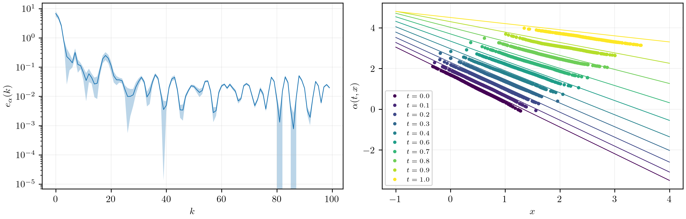
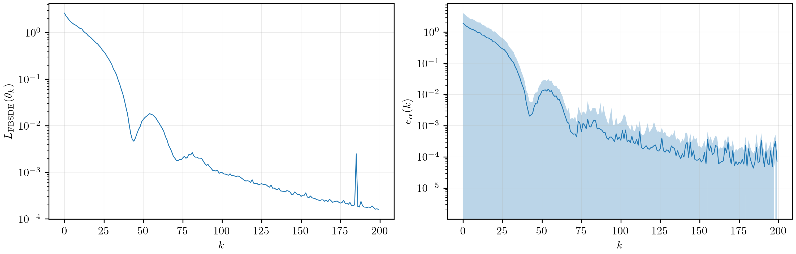
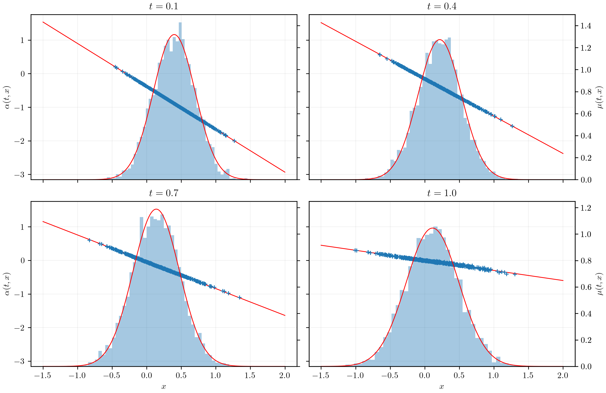
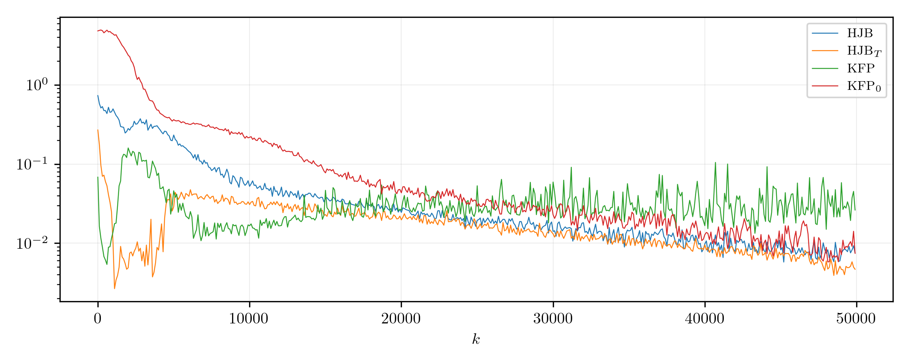
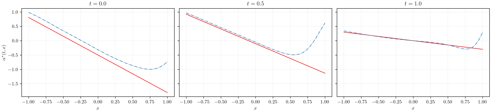
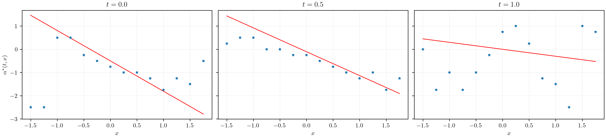
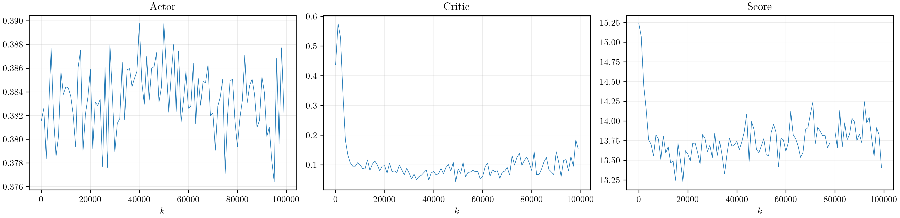
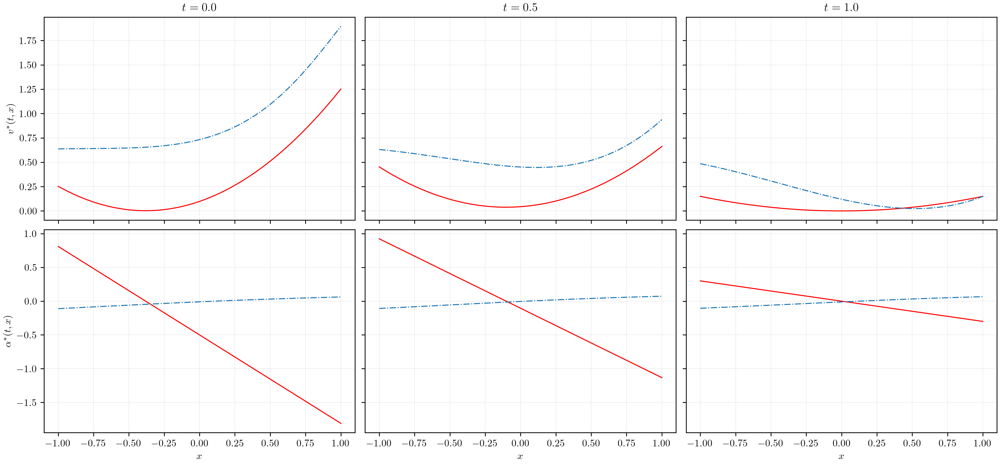

# Mean-Field Optimal Execution

In modern financial markets, **high-frequency trading (HFT)** has transformed how liquidity is provided and how large transactions are executed.
A central issue in this context is the **optimal execution problem**, where a trader seeks to execute a large order over a finite horizon while minimizing trading costs and mitigating the adverse impact of their own activity on market prices.

The challenge arises from the interplay between two opposing forces:

- Trading **too quickly** increases transaction costs due to price impact.
- Trading **too slowly** exposes the trader to price volatility and inventory risk.

Over the past two decades, this problem has been extensively studied within the framework of stochastic control.
In particular, when multiple strategic traders interact, the problem naturally falls within the scope of **Mean Field Games (MFGs)**, a theory introduced by *Lasry and Lions (2007)*.
In such a framework, the market is modeled as a large population of agents, each optimizing their own execution strategy while collectively influencing the dynamics of asset prices.
The mean-field formulation overcomes the curse of dimensionality inherent in the $N$-player stochastic game by replacing the empirical distribution of controls with its limiting law, thereby providing a tractable approximation of a **Nash equilibrium**.

## Overview

`mf-optimal-execution` is a research framework and codebase developed as part of my **research memoir** at Paris Dauphine-PSL under the supervision of [Julien Claisse](https://www.ceremade.dauphine.fr/fr/membres/detail-cv/profile/julien-claisse.html), on deep learning methods for **Mean-Field Control (MFC)** and **Mean-Field Game (MFG)** formulations of the **optimal execution** problem under **price impact**.
The full memoir is included in this repository for reference.

This project implements and compares a variety of modern solution techniques, both classical and deep-learning based:

- **Direct MFC:** Direct stochastic control under McKean–Vlasov dynamics
- **MKV FBSDE:** McKean–Vlasov Forward-Backward Stochastic Differential Equations
- **DGM:** Deep Galerkin Method for PDE-based solutions
- **FH-MF-QL:** Finite-horizon Mean-Field Q-Learning
- **FH-MF-AC:** Finite-horizon Mean-Field Actor-Critic

Each method is benchmarked against closed-form solutions, and the framework provides training scripts and reproducible notebooks to facilitate analysis and experimentation.

## Problem Description

In the optimal execution problem, an agent seeks to liquidate (or acquire) a position over a fixed horizon $[0,T]$ while accounting for price impact and inventory risk.

The state dynamics are typically modeled as:
$$
    dX_t = \alpha_t dt + \sigma dW_t
$$
where:

- $\alpha_t$ is the trading rate (control),
- $\sigma$ is the volatility,
- $W_t$ is a Brownian motion.

The objective is to minimize a cost functional of the form:
$$
    J(\alpha) = \mathbb{E}\Bigg[\int_0^T \Big(
        \frac{c_X}{2} X_t^2
        + \frac{c_\alpha}{2} \alpha_t^2
        - \gamma X_t \int_{\mathbb{R}} a \, \nu_t(da)
    \Big) dt + \frac{c_g}{2} X_T^2 \Bigg].
$$

For a complete derivation, theoretical background, and detailed discussion, see the accompanying [**Memoir**](Memoir.pdf), which contains the full research text associated with this repository.

## Numerical Results

We present below several representative numerical results and plots that can be reproduced using this package.

### Direct MFC

A direct solver that minimizes the cost functional under the McKean–Vlasov dynamics.

**MFC Training & Benchmark:**

---

### MKV FBSDE Method

We solve the McKean–Vlasov mean-field problem using a **Forward-Backward Stochastic Differential Equation** (FBSDE) approach.
The learned control closely matches the analytical solution, demonstrating accurate convergence.

**MFG Training:**

**MFG Benchmark:**

---

### Deep Galerkin Method (DGM)

The DGM approach parameterizes both the value function and the population distribution with neural networks, enforcing that the **Hamilton–Jacobi–Bellman** and **Kolmogorov-Fokker–Planck** PDEs are jointly satisfied.
It offers a mesh-free forward–backward PDE solver.

**MFG Training:**

**MFG Benchmark:**

---

### Mean-Field Q-Learning (FH-MF-QL)

A model-free reinforcement learning approach that directly approximates the optimal **Q-function** in the mean-field setting using a two time-scale algorithm.
This approach can approximate either the MFG or MFC solution and enables control synthesis even when the model dynamics are unknown.

**MFG Benchmark:**

---

### Mean-Field Actor-Critic (FH-MF-AC)

A model-free deep reinforcement learning method in which the policy (actor), value function (critic), and control distribution (score) are learned jointly using a three time-scale algorithm.
The actor–critic framework shows lower performance compared to previous methods, providing an interesting baseline for future improvements.

**MFG Training:**

**MFG Benchmark:**

## Further Reading

For a complete mathematical treatment, algorithmic derivations, and an in-depth discussion of results, please consult the accompanying research [**Memoir**](Memoir.pdf).
